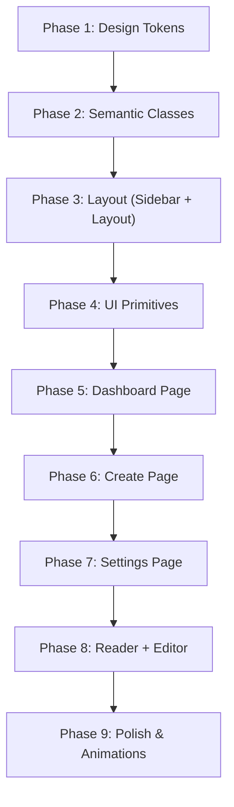

# PLAN: Crimson Ink UI/UX Full Overhaul

> **Design Direction:** Option B — "Crimson Ink" (Deep Red & Charcoal)
> **Typography:** Keep Plus Jakarta Sans (existing)
> **Scope:** Full overhaul — all pages + components
> **Estimated Effort:** 4-5 days

---

## Background

weoweo hiện dùng generic dark navy theme (#0A0E1A) với blue accent (#3B82F6). User muốn nâng cấp lên enterprise SaaS-grade, lấy cảm hứng từ Tripo3D. Brainstorm đã chọn hướng **"Crimson Ink"** — lấy cảm hứng từ văn hóa mực manga Nhật Bản: deep charcoal base + red/crimson accent.

**Triết lý:** Manga ink culture meets digital premium. Red accent gợi lên năng lượng sáng tạo, distinct từ mọi AI tool khác trên thị trường (99% dùng blue/teal).

---

## Proposed Changes

### Foundation Layer — Design Tokens & Semantic Classes

#### [MODIFY] [design-tokens.css](file:///Users/binhan/weoweo/weoweo/src/styles/design-tokens.css)

Overhaul toàn bộ color palette từ navy-blue sang charcoal-red:

| Token Group | Current | New (Crimson Ink) |
|-------------|---------|-------------------|
| **Canvas** | `#0A0E1A` (navy) | `#0F0F14` (near-black charcoal) |
| **Surface** | `rgba(17,24,43)` (navy glass) | `rgba(26,26,34)` (charcoal glass) |
| **Surface Strong** | `rgba(22,30,52)` | `rgba(32,32,42)` |
| **Nav** | `rgba(13,18,33)` | `rgba(18,18,24)` |
| **Text Primary** | `#F1F5F9` (blue-tint white) | `#F7FAFC` (crisp white) |
| **Text Secondary** | `#94A3B8` (slate) | `#A0AEC0` (warm gray) |
| **Text Muted** | `#475569` (slate) | `#4A5568` (warm gray) |
| **Accent From** | `#3B82F6` (blue) | `#E53E3E` (crimson red) |
| **Accent To** | `#60A5FA` (light blue) | `#FC8181` (soft red/salmon) |
| **CTA From** | `#F97066` (coral) | `#C53030` (deep red) |
| **CTA To** | `#FB923C` (orange) | `#E53E3E` (crimson) |
| **Focus Ring** | `rgba(59,130,246)` (blue) | `rgba(229,62,62)` (red) |
| **Stroke Focus** | `rgba(59,130,246,0.64)` | `rgba(229,62,62,0.64)` |
| **Tone Info BG/FG** | blue-based | Giữ blue cho info |
| **Tone Success** | green-based | Giữ green |
| **Tone Warning** | amber-based | Giữ amber |
| **Tone Danger** | red-based | Đổi sang deeper red |

Thêm tokens mới:
- `--weo-accent-glow`: `rgba(229,62,62,0.15)` — for hover glow effect
- `--weo-surface-card`: `rgba(30,30,40,0.6)` — for glassmorphic cards
- `--weo-surface-inset`: `#0C0C10` — for inset input fields

---

#### [MODIFY] [semantic-classes.css](file:///Users/binhan/weoweo/weoweo/src/styles/semantic-classes.css)

- **No-Line Rule**: Cập nhật `.weo-surface` bỏ `border: 1px solid` → dùng tonal background shifts
- **Button Glow**: `.weo-btn-primary:hover` thêm glow shadow (`0 0 20px var(--weo-accent-glow)`)
- **Card Footer**: Thêm `.weo-surface-footer` class cho card bottom section (tonal shift)
- **Ghost Border**: Thêm `.weo-ghost-border` class cho dividers cần accessibility
- Thêm `.weo-pill` class cho category filter pills

---

#### [MODIFY] [globals.css](file:///Users/binhan/weoweo/weoweo/src/app/globals.css)

- Thêm cinematic animation easing: `cubic-bezier(0.19, 1, 0.22, 1)` — ease-out-expo
- Thêm `@keyframes glowPulse` cho active elements
- Thêm manga-style halftone noise overlay utility (3% opacity, `.weo-halftone`)
- Cập nhật progress bar gradient sang crimson

---

### Layout Layer

#### [MODIFY] [layout.tsx](file:///Users/binhan/weoweo/weoweo/src/app/layout.tsx)

- Cập nhật Google Fonts: giữ Plus Jakarta Sans, thêm weight 800 cho extra-bold headings

---

#### [MODIFY] [Sidebar.tsx](file:///Users/binhan/weoweo/weoweo/src/components/layout/Sidebar.tsx)

Redesign sidebar:
- Bỏ `borderRight: '1px solid'` → dùng background color contrast
- Active item: **"Crimson Thread"** — vertical 3px left border `var(--weo-accent-from)` + tonal background lift
- Thêm nav items: "My Comics" và "Editor" (hiện chỉ có Dashboard, Create, Settings)
- Thêm "Upgrade to Pro" badge area ở bottom (trước user section)
- Logo sparkle icon đổi màu sang crimson
- Hover states: smooth tonal shift thay vì ghost background

---

### Page Layer — Dashboard

#### [MODIFY] [page.tsx (Dashboard)](file:///Users/binhan/weoweo/weoweo/src/app/page.tsx)

**Structural redesign:**

1. **Hero Section** (mới — thêm vào trên cùng):
   - Headline: "Turn Novels into Visual Masterpieces." — bold, tight tracking
   - Large text input area: glassmorphic card chứa textarea "Paste your web novel chapter..."
   - CTA: `[✨ Generate Comic]` — gradient button (crimson)
   - Phía dưới input: `📎 Reference Image` + `🎨 Style Preset` badges
   - Subtle manga halftone background overlay

2. **Category Filter Pills** (mới):
   - Row of pills: `[All] [Manga] [Webtoon] [Manhwa] [Featured]`
   - Active: crimson background
   - Inactive: surface-container background

3. **Gallery Grid** (upgrade từ episode grid):
   - Card thêm thumbnail placeholder area (16:9 aspect ratio)
   - Art style badge overlay trên thumbnail
   - Panel count + date metadata  
   - Status chip redesigned (crimson = complete, amber = in progress)
   - Hover: scale(1.02) + ambient shadow lift + glow
   - FAB button "+" ở góc phải

4. **Empty State** (upgrade):
   - Thay vì box trống → show inspiration gallery hoặc sample comics
   - Animated manga brush-stroke icon

---

### Page Layer — Create

#### [MODIFY] [create/page.tsx](file:///Users/binhan/weoweo/weoweo/src/app/create/page.tsx)

- Cập nhật color references từ blue → crimson
- Progress bar gradient: crimson → salmon
- Done state icon: crimson accent
- Error banner: consistent với new danger tone
- API key guard: consistent styling

---

### Page Layer — Settings

#### [MODIFY] [settings/page.tsx](file:///Users/binhan/weoweo/weoweo/src/app/settings/page.tsx)

- Provider selector card: active border → crimson
- Key input fields: inset style (dark background, no border)
- Section headers: tighter, bolder
- Security section: subtle crimson accents

---

### Page Layer — Reader

#### [MODIFY] [read/[episodeId]/page.tsx](file:///Users/binhan/weoweo/weoweo/src/app/read/[episodeId]/page.tsx)

- Background canvas: charcoal
- Page navigation: crimson accent buttons
- Manga-style page transitions

---

### Page Layer — Editor

#### [MODIFY] [editor/[episodeId]/page.tsx](file:///Users/binhan/weoweo/weoweo/src/app/editor/[episodeId]/page.tsx)

- Canvas toolbar: charcoal surface, crimson active states
- Sidebar panels: tonal layering
- Bubble type icons: color-coded with new palette

---

### UI Components

#### [MODIFY] [Button.tsx](file:///Users/binhan/weoweo/weoweo/src/components/ui/Button.tsx)

- Primary variant: crimson gradient → salmon (auto via tokens)
- Hover glow: `box-shadow: 0 0 20px var(--weo-accent-glow)`
- Transition: ease-out-expo curve

#### [MODIFY] [Surface.tsx](file:///Users/binhan/weoweo/weoweo/src/components/ui/Surface.tsx)

- Bỏ border → pure tonal layering
- Interactive variant: hover glow thay vì border change
- Thêm `variant="card"` cho glassmorphic gallery cards

#### [MODIFY] [StatusChip.tsx](file:///Users/binhan/weoweo/weoweo/src/components/ui/StatusChip.tsx)

- Success chip: crimson (complete)
- Warning chip: amber (in progress)
- Danger chip: deep red (error)

#### [MODIFY] [Input.tsx](file:///Users/binhan/weoweo/weoweo/src/components/ui/Input.tsx)

- Inset style: dark background, no border, `var(--weo-surface-inset)`
- Focus: ghost border + tonal shift

#### [MODIFY] [Modal.tsx](file:///Users/binhan/weoweo/weoweo/src/components/ui/Modal.tsx)

- Glassmorphic: backdrop-blur 24px + charcoal surface at 40% opacity

#### [MODIFY] [icons.tsx](file:///Users/binhan/weoweo/weoweo/src/components/ui/icons.tsx)

- Thêm icons: `manga`, `brush`, `crown` (pro badge), `fire` (featured)

---

### Comic Components

#### [MODIFY] [GenerateForm.tsx](file:///Users/binhan/weoweo/weoweo/src/components/GenerateForm.tsx)

- Textarea: larger, glassmorphic card wrapper
- Art style selector: pill-style instead of select dropdown
- Page count slider: crimson track color

#### [MODIFY] [ProgressBar.tsx](file:///Users/binhan/weoweo/weoweo/src/components/ProgressBar.tsx)

- Gradient: crimson → salmon
- Add phase icon animation

#### [MODIFY] [ReviewAnalysis.tsx](file:///Users/binhan/weoweo/weoweo/src/components/ReviewAnalysis.tsx)

- Cards: glassmorphic, tonal layering
- Character/location cards: crimson accent borders on hover

#### [MODIFY] [ReviewStoryboard.tsx](file:///Users/binhan/weoweo/weoweo/src/components/ReviewStoryboard.tsx)

- Panel cards: charcoal surface, crimson approval states
- Manga-panel style overlapping card layout

#### [MODIFY] [ComicReader.tsx](file:///Users/binhan/weoweo/weoweo/src/components/ComicReader.tsx)

- Dark reading mode, crimson page indicators

#### [MODIFY] [SpeechBubble.tsx](file:///Users/binhan/weoweo/weoweo/src/components/SpeechBubble.tsx)

- Bubble border: subtle crimson hint

---

### Editor Components

#### [MODIFY] [CanvasEditor.tsx](file:///Users/binhan/weoweo/weoweo/src/components/editor/CanvasEditor.tsx)

- Toolbar: charcoal, crimson active tools
- Canvas border: ghost border style

#### [MODIFY] [BubbleToolbar.tsx](file:///Users/binhan/weoweo/weoweo/src/components/editor/BubbleToolbar.tsx)

- Active tool: crimson background

#### [MODIFY] [DialoguePanel.tsx](file:///Users/binhan/weoweo/weoweo/src/components/editor/DialoguePanel.tsx)

- Panel background: tonal layering

#### [MODIFY] [ExportBar.tsx](file:///Users/binhan/weoweo/weoweo/src/components/editor/ExportBar.tsx)

- Export buttons: crimson primary CTA

---

## Implementation Order

Phải theo thứ tự này vì dependencies:



| Phase | Files | Est. Time |
|-------|-------|-----------|
| 1. Design Tokens | `design-tokens.css` | 2h |
| 2. Semantic Classes | `semantic-classes.css`, `globals.css` | 2h |
| 3. Layout | `Sidebar.tsx`, `layout.tsx` | 3h |
| 4. UI Primitives | `Button`, `Surface`, `StatusChip`, `Input`, `Modal`, `icons` | 3h |
| 5. Dashboard | `page.tsx` (hero, gallery, filters) | 4h |
| 6. Create | `create/page.tsx`, `GenerateForm`, `ProgressBar`, `ReviewAnalysis`, `ReviewStoryboard` | 3h |
| 7. Settings | `settings/page.tsx` | 2h |
| 8. Reader + Editor | `read/`, `editor/`, `ComicReader`, `SpeechBubble`, canvas components | 3h |
| 9. Polish | Animations, hover states, transitions, halftone | 2h |

**Total: ~24 hours / ~4-5 working days**

---

## Verification Plan

### Automated Tests

Existing tests (5 files in `src/lib/__tests__/`) are backend-focused (auth, crypto, rate-limit, security). They should continue passing since we're only changing UI:

```bash
cd /Users/binhan/weoweo/weoweo && npm test
```

### Build Verification

Sau mỗi phase, verify build passes:

```bash
cd /Users/binhan/weoweo/weoweo && npm run build
```

### Visual Verification (Browser)

Sau mỗi phase, capture screenshots qua browser tool để so sánh:

1. **Phase 1-2** → Verify token swap — tất cả pages chuyển sang charcoal+red
2. **Phase 3** → Verify sidebar: golden thread active state, no border, nav items
3. **Phase 5** → Verify Dashboard: hero section, gallery grid, filter pills
4. **Phase 6** → Verify Create: form, progress bar, review screens
5. **Phase 7** → Verify Settings: provider selector, input styling
6. **Phase 9** → Full visual regression — all pages look premium

### Manual Verification (User)

> [!IMPORTANT]
> Sau Phase 5 (Dashboard) và Phase 9 (Final), anh mở `http://localhost:3000` review toàn bộ UI. Đặc biệt kiểm tra:
> - Color palette có đúng vibe "Crimson Ink" không
> - Hero section có gây ấn tượng mạnh không
> - Gallery cards có premium feel không
> - Sidebar navigation có smooth không
> - Responsive trên mobile viewport (thu nhỏ browser)

---

## Files Modified (Total: ~25 files)

| Category | Count | Files |
|----------|-------|-------|
| Design System | 3 | `design-tokens.css`, `semantic-classes.css`, `globals.css` |
| Layout | 2 | `layout.tsx`, `Sidebar.tsx` |
| Pages | 5 | `page.tsx`, `create/page.tsx`, `settings/page.tsx`, `read/page.tsx`, `editor/page.tsx` |
| UI Primitives | 6 | `Button`, `Surface`, `StatusChip`, `Input`, `Modal`, `icons` |
| Components | 5 | `GenerateForm`, `ProgressBar`, `ReviewAnalysis`, `ReviewStoryboard`, `ComicReader`, `SpeechBubble` |
| Editor | 4 | `CanvasEditor`, `BubbleToolbar`, `DialoguePanel`, `ExportBar` |
