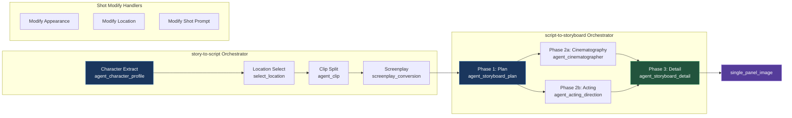
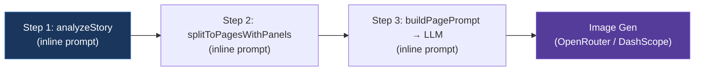

# Báo cáo so sánh chi tiết: Waoowaoo vs Weoweo Prompt Builder

---

## I. Tổng quan kiến trúc

### Waoowaoo — "Film Studio" model



### Weoweo — "Quick Sketch" model



---

## II. So sánh chi tiết theo từng khía cạnh

### 1. Prompt Management

| | Waoowaoo | Weoweo |
|---|---|---|
| **Cấu trúc** | Hệ thống [prompt-i18n](file:///Users/binhan/weoweo/waoowaoo/src/lib/prompt-i18n) tập trung: 28 prompt IDs, 50 [.txt](file:///Users/binhan/weoweo/waoowaoo/lib/prompts/novel-promotion/agent_clip.en.txt) template files | 3 prompt strings inline trong `PROMPTS` object |
| **Template engine** | [buildPrompt()](file:///Users/binhan/weoweo/waoowaoo/src/lib/prompt-i18n/build-prompt.ts#34-99) — validate variables, regex replace `{placeholder}`, throw on missing/extra | String `.replace()` trực tiếp |
| **Validation** | ✅ Bắt buộc — thiếu biến → crash, biến thừa → crash | ❌ Không — sai biến = silent bug |
| **i18n** | ✅ English + Chinese (mỗi prompt 2 files) | ❌ Chỉ English |
| **Caching** | ✅ `Map<string, string>` — load 1 lần từ disk | N/A (inline) |
| **Tách biệt** | Template riêng file [.txt](file:///Users/binhan/weoweo/waoowaoo/lib/prompts/novel-promotion/agent_clip.en.txt), code riêng [.ts](file:///Users/binhan/weoweo/weoweo/src/lib/ai/prompts.ts) | Prompt lẫn trong code |

**Files liên quan waoowaoo:**
- [prompt-ids.ts](file:///Users/binhan/weoweo/waoowaoo/src/lib/prompt-i18n/prompt-ids.ts) — 28 IDs
- [catalog.ts](file:///Users/binhan/weoweo/waoowaoo/src/lib/prompt-i18n/catalog.ts) — Map ID → path + variables
- [build-prompt.ts](file:///Users/binhan/weoweo/waoowaoo/src/lib/prompt-i18n/build-prompt.ts) — Engine
- [template-store.ts](file:///Users/binhan/weoweo/waoowaoo/src/lib/prompt-i18n/template-store.ts) — Load + cache

**Files liên quan weoweo:**
- [prompts.ts](file:///Users/binhan/weoweo/weoweo/src/lib/ai/prompts.ts) — Tất cả 3 prompts

---

### 2. Pipeline Depth (số LLM calls)

| Phase | Waoowaoo | Weoweo |
|-------|----------|--------|
| Character analysis | `agent_character_profile` → **16 fields** (age_range, gender, role_level, costume_tier, visual_keywords, expected_appearances...) | `analyzeStory` → **3 fields** (name, aliases, description) |
| Location analysis | `select_location` (riêng) | Gộp chung trong `analyzeStory` |
| Clip/Page split | `agent_clip` → clips with start/end boundaries | `splitToPagesWithPanels` → pages with panels |
| Screenplay | `screenplay_conversion` (riêng) | ❌ Không có |
| Storyboard plan | `agent_storyboard_plan` → panels với `source_text`, `shot_type`, `camera_move`, `video_prompt` | Gộp chung trong split step |
| Cinematography | `agent_cinematographer` → composition, lighting, color_palette, atmosphere | ❌ Không có |
| Acting direction | `agent_acting_direction` → per-character acting notes | ❌ Không có |
| Detail refine | `agent_storyboard_detail` → refined panels with age+gender | ❌ Không có |
| **Tổng LLM calls** | **7+ / clip** (+ parallel runs) | **3 total** |

---

### 3. Context truyền xuống Image Gen

#### Waoowaoo — [single_panel_image.en.txt](file:///Users/binhan/weoweo/waoowaoo/lib/prompts/novel-promotion/single_panel_image.en.txt)

```
Storyboard panel data:        ← JSON gồm: description, shot_type, camera_move,
{storyboard_text_json_input}     characters (name + appearance), location, scene_type,
                                  photographyPlan (composition, lighting, color_palette,
                                  atmosphere, technicalNotes), actingNotes

Source text:                   ← Nguyên văn truyện cho panel này
{source_text}

Style requirement:             ← Art style
{style}

Aspect ratio:                  ← Tỷ lệ khung hình
{aspect_ratio}

Rule #4: If storyboard conflicts with source text,
         keep narrative logic from source text.
```

#### Weoweo — `buildPageImagePrompt` (inline)

```
Style: {style}                 ← Art style
Number of panels: {panel_count}
Panel descriptions:            ← Mỗi panel chỉ 1 dòng "Panel X (medium): description"
{panel_descriptions}

Characters info: {characters}  ← Chỉ "name: description" flat string
```

> [!CAUTION]
> **Weoweo thiếu hoàn toàn:** source text, mood/atmosphere, lighting, color palette, camera direction, character age/gender specifics, scene type, và faithfulness enforcement rules.

---

### 4. Error Handling & Retry

| | Waoowaoo | Weoweo |
|---|---|---|
| **Retry** | [runStepWithRetry()](file:///Users/binhan/weoweo/waoowaoo/src/lib/novel-promotion/script-to-storyboard/orchestrator.ts#208-263) — 3 attempts, exponential backoff (2^n × 1000ms + jitter) | ❌ Không retry |
| **JSON parse** | `safeParseJsonArray` + [JsonParseError](file:///Users/binhan/weoweo/waoowaoo/src/lib/novel-promotion/script-to-storyboard/orchestrator.ts#95-103) class → tự động retry | Pray for valid JSON 🙏 |
| **Error classification** | Smart: phân biệt retryable vs non-retryable errors | Catch-all throw |
| **Progress tracking** | `reportTaskProgress()` với stage labels | [updateEpisode()](file:///Users/binhan/weoweo/weoweo/src/lib/pipeline/orchestrator.ts#332-338) chỉ % |
| **Streaming** | ✅ `withInternalLLMStreamCallbacks` — realtime | ❌ Đợi full response |

---

### 5. Storyboard Quality Pipeline

Waoowaoo chạy **3 phase tuần tự** cho mỗi clip, Phase 2 song song:

```
Phase 1 (Plan)
    ├── Phase 2a (Cinematography) ─┐  ← Promise.all
    └── Phase 2b (Acting)         ─┘
         Phase 3 (Detail Refine)
              ↓
         mergePanelsWithRules()
```

Kết quả cuối cùng mỗi panel có:
- `description`, `shot_type`, `camera_move`, `video_prompt`
- `photographyPlan`: { composition, lighting, colorPalette, atmosphere, technicalNotes }
- `actingNotes`: per-character acting directions
- `source_text`: nguyên văn truyện

Weoweo: 1 LLM call → panels với `description` + `shotType` + `characters` + `location`. **Không có** photography plan, acting notes, hay source_text.

---

### 6. Concurrency & Performance

| | Waoowaoo | Weoweo |
|---|---|---|
| **Clip processing** | `mapWithConcurrency(clips, concurrency, ...)` — tunable | Sequential `for` loop |
| **Phase parallelism** | Phase 2a + 2b = `Promise.all` | N/A |
| **Image generation** | Per-panel (1 image = 1 panel) | Per-page (1 image = N panels) |
| **Rate limiting** | BullMQ job queue | Token-bucket `imageRateLimiter` |

---

## III. Bảng tổng hợp sức mạnh

| Capability | Waoowaoo | Weoweo | Gap |
|:-----------|:--------:|:------:|:---:|
| Source text preservation | ✅ | ❌ | 🔴 Critical |
| Character detail (age, gender, costume) | ✅ 16 fields | ❌ 3 fields | 🔴 Critical |
| Mood/atmosphere per scene | ✅ Dedicated phase | ❌ | 🟡 High |
| Lighting/color palette | ✅ Per-panel | ❌ | 🟡 High |
| Faithfulness enforcement | ✅ Explicit rule | ❌ | 🔴 Critical |
| Cross-scene consistency | ✅ Character library | ⚠️ Character sheets only | 🟡 Medium |
| Prompt validation | ✅ Strict | ❌ None | 🟡 Medium |
| Retry logic | ✅ 3x exponential | ❌ | 🟡 Medium |
| Acting direction | ✅ | ❌ | 🔵 Nice-to-have |
| i18n prompts | ✅ EN + ZH | ❌ EN only | 🔵 Nice-to-have |
| Concurrency | ✅ Tunable | ❌ Sequential | 🔵 Nice-to-have |

---

## IV. Research Prompt

Dưới đây là prompt anh có thể mang đi nghiên cứu:

---

````markdown
# Research Prompt: Improving Weoweo's Comic Prompt Builder

## Context

I'm building **weoweo** — an AI comic generator that converts story text into manga/webtoon pages. The current pipeline is simple:

1. **analyzeStory** (1 LLM call) → extract characters (name, aliases, description) and locations
2. **splitToPagesWithPanels** (1 LLM call) → split story into pages with panel descriptions
3. **buildPagePrompt** (1 LLM call) → convert panel descriptions into image generation prompt
4. **Image Gen** → send prompt to Seedream/DashScope

### Current Problems (validated by test runs)

| Problem | Root Cause |
|---------|-----------|
| Generated images show wrong content (e.g., sword fights instead of quiet scenes) | `buildPageImagePrompt` is too generic — only passes panel descriptions without original story text |
| Characters don't match (e.g., 12-year-old boy rendered as handsome adult) | Character extraction only captures `name + aliases + description` — no age, gender, body type, costume tier |
| 5 pages have inconsistent style/mood | Each page generates prompt independently — no shared scene context, no mood/atmosphere guidance |
| AI "invents" action scenes that don't exist | No faithfulness enforcement — prompt says "describe panels" without anchoring to source text |

### Reference System (Waoowaoo)

A more mature system (waoowaoo) solves these exact problems with:

1. **Rich character extraction** — 16 fields including `age_range`, `gender`, `costume_tier`, `visual_keywords`, `primary_identifier`, `expected_appearances`
2. **Source text preservation** — a `source_text` field travels from story → storyboard → image prompt, with rule: "If storyboard conflicts with source text, keep narrative logic from source text"
3. **Dedicated cinematography phase** — generates per-panel `composition`, `lighting`, `color_palette`, `atmosphere`, `technical_notes`
4. **3-phase storyboard refinement** — Plan → Cinematography + Acting (parallel) → Detail Refine
5. **Centralized prompt management** — 28 registered prompt IDs with `.txt` template files, variable validation, and i18n support
6. **Retry with exponential backoff** — 3 attempts per LLM call, smart error classification

## Questions to Research

### Priority 1: Content Accuracy

1. **How should I pass `source_text` through the pipeline?** The original Vietnamese story text must reach the image prompt builder. Should I:
   - Store `source_text` per-page in the `splitToPagesWithPanels` output?
   - Store `source_text` per-panel?
   - Pass the full story context to every image prompt call?
   
2. **What faithfulness rules should the image prompt include?** Waoowaoo uses "If storyboard conflicts with source text, keep narrative logic from source text." Is this sufficient, or do I need more specific rules like:
   - "DO NOT add combat/action scenes not in source text"
   - "DO NOT change character ages or genders"
   - "DO NOT add romantic elements not in source text"

### Priority 2: Character Accuracy

3. **What character fields are essential for comic generation?** Waoowaoo extracts 16 fields. For comic (not video), which subset is critical?
   - `age_range` — YES (prevents age mismatches)
   - `gender` — YES (prevents gender swaps)
   - `costume_tier` — MAYBE (for clothing accuracy)
   - `visual_keywords` — YES (for consistent appearance)
   - `expected_appearances` — MAYBE (for costume changes)
   
4. **Should I add a character visual enhancement LLM step?** Waoowaoo has `agent_character_visual` that generates detailed visual descriptions from character profiles. Is a separate step worth the cost?

### Priority 3: Mood/Atmosphere

5. **Should I add a dedicated "cinematography" phase or inline it?** Options:
   - **A: Dedicated phase** (waoowaoo approach) — separate LLM call generates composition, lighting, color_palette, atmosphere per panel. Expensive but precise.
   - **B: Inline in storyboard** — add `mood` and `atmosphere` fields to `splitToPagesWithPanels` output schema. Cheaper but less detailed.
   - **C: Inline in image prompt** — add mood/atmosphere extraction directly in `buildPageImagePrompt`. Cheapest but most coupled.

6. **How to maintain visual consistency across pages?** Options:
   - **A: Global scene context** — 2-3 sentence summary of overall setting/time-of-day/weather passed to every page
   - **B: Page numbering** — include `pageNumber/totalPages` so LLM knows position in story
   - **C: Previous page context** — pass previous page's mood/description to next page
   - **D: Character library reference** — structured character descriptions + reference images (weoweo already does this partially)

### Priority 4: Architecture

7. **Should I adopt waoowaoo's `prompt-i18n` template system?** Trade-offs:
   - **Pro:** Centralized, validated, testable, i18n-ready
   - **Con:** Overhead for a small project (weoweo has only ~5 prompts vs waoowaoo's 28)
   - **Middle ground?** Could I do template files without the full validation/i18n machinery?

8. **How many total LLM calls is the sweet spot?** Waoowaoo does 7+ calls per clip. For comic generation:
   - Current: 3 calls total → quality too low
   - Full waoowaoo: 7+ calls → expensive and slow
   - Proposed middle ground: 4-5 calls (analyze → storyboard with enriched fields → page-level cinematography inline → image prompt with full context → image gen)

### Priority 5: Error Handling

9. **Should I add retry logic for LLM calls?** Cost-benefit:
   - JSON parse failures are the #1 error type
   - Adding `safeParseJsonArray` + 3 retries with exponential backoff would cover 90% of cases
   - Worth the complexity?

## Constraints

- **Budget**: Keep LLM costs manageable — each page shouldn't require 7 separate LLM calls
- **Speed**: Users expect results in 2-5 minutes for 5 pages, not 15 minutes
- **Simplicity**: Weoweo is an MVP — don't over-engineer. Pick the 20% improvements that give 80% quality gain
- **Tech stack**: Next.js 15, Prisma/SQLite, OpenRouter/DashScope for images

## Desired Output

Please provide:
1. A prioritized list of improvements (what gives the biggest quality gain per effort)
2. For each improvement, provide the specific prompt template or code change needed
3. Suggest the optimal number of LLM calls for cost/quality balance
4. Flag any risks or trade-offs of each approach
````

---

> [!TIP]
> Prompt trên được thiết kế để anh có thể paste vào bất kỳ AI nào (Claude, GPT, Gemini) và nhận được phân tích + recommendations chi tiết. Nó chứa đủ context về cả 2 hệ thống mà không cần access codebase.
